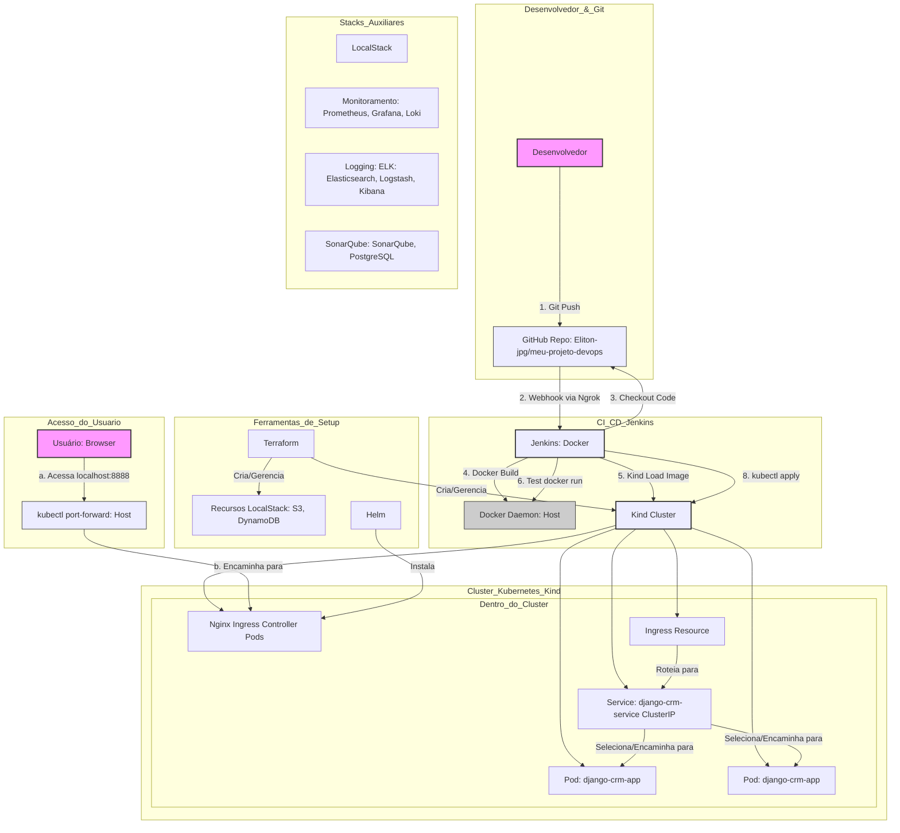
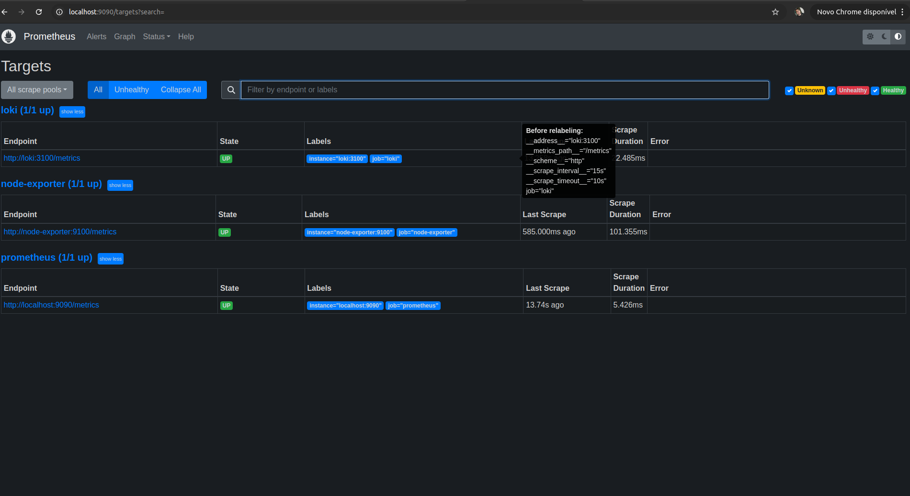
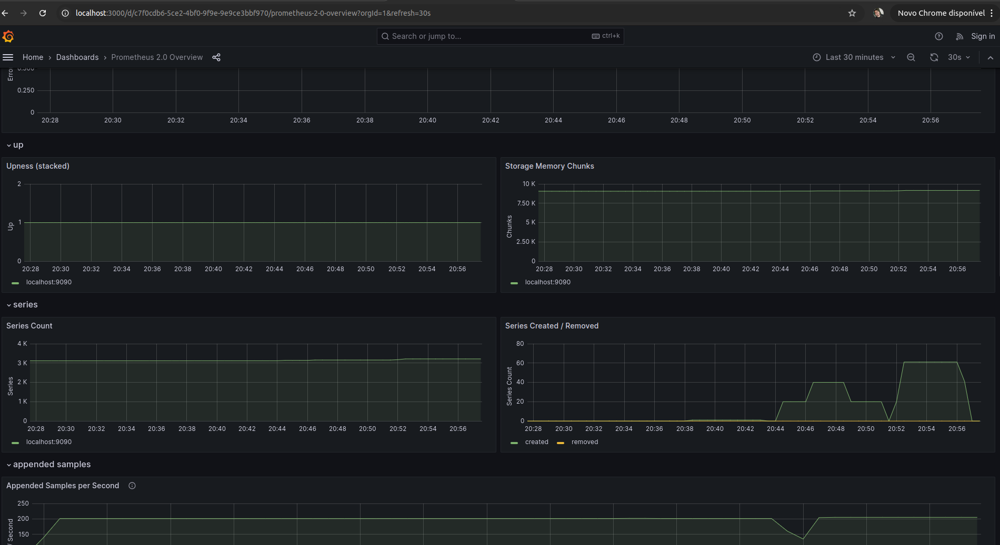
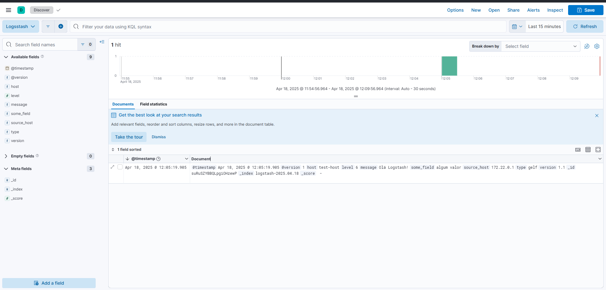
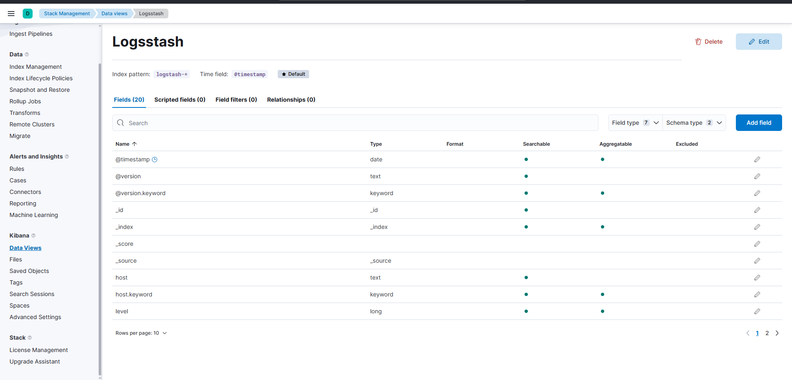
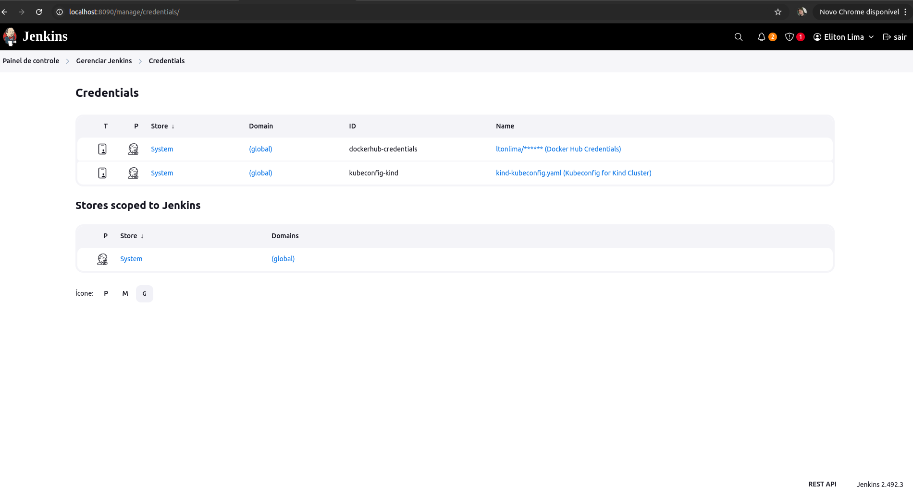
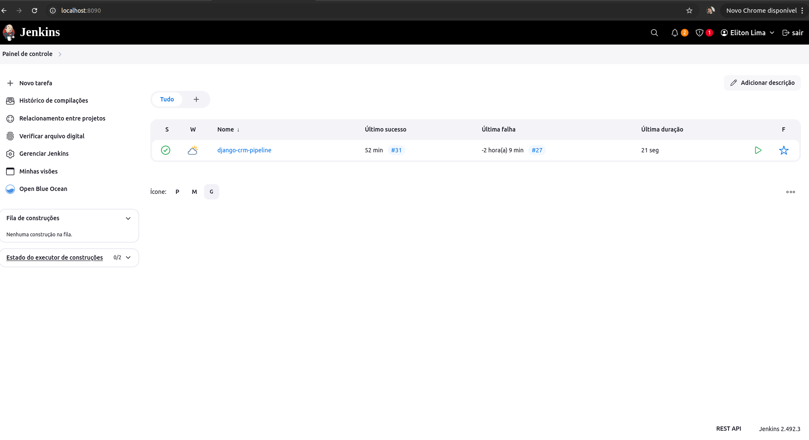

# Teste Técnico DevOps Jr: Implantação de Aplicação Web com CI/CD

## Introdução

Este repositório documenta a solução desenvolvida para o teste técnico de Engenheiro DevOps Jr. O objetivo era configurar um ambiente automatizado e escalável para implantar uma aplicação web Django (com PostgreSQL e MongoDB) em contêineres Docker, orquestrados com Kubernetes (Kind localmente), e implementar um pipeline de CI/CD com Jenkins. O ambiente de staging simulou serviços AWS usando LocalStack e Terraform, enquanto stacks auxiliares (Monitoramento, Logging, Qualidade) foram gerenciadas com Docker Compose

## Cenário Proposto

Implantar uma aplicação web Python/Django em staging (local) e produção (AWS - *não abordado neste teste*).

* **Banco de Dados:** PostgreSQL (aplicação)
* **Logs:** MongoDB (aplicação)
* **Infraestrutura:** Docker, Kubernetes (Kind localmente)
* **Automação:** Terraform (IaC), Jenkins (CI/CD)
* **Staging Local:** LocalStack para simular AWS (S3, DynamoDB)
* **Monitoramento:** Prometheus, Grafana, Loki
* **Qualidade:** SonarQube
* **Logging Centralizado:** ELK Stack (Elasticsearch, Logstash, Kibana)
* **Ingress:** Nginx Ingress Controller (Helm)

## Arquitetura Adotada (Ambiente Staging Local)

* **Host:** Ubuntu Linux
* **Orquestração:** Kubernetes (cluster local via Kind)
* **Infraestrutura como Código (IaC):** Terraform para provisionar:
  * Recursos AWS simulados no LocalStack (S3 Bucket, Tabela DynamoDB).
  * Cluster Kubernetes Kind.
* **Conteinerização:** Docker para a aplicação Django e serviços auxiliares.
* **CI/CD:** Jenkins rodando em Docker, com pipeline definido em `Jenkinsfile`.
* **Ingress:** Nginx Ingress Controller instalado via Helm no cluster Kind.
* **Stacks Auxiliares (Docker Compose):**
  * **LocalStack:** Simulação AWS.
  * **Monitoramento:** Prometheus, Grafana, Loki, Promtail.
  * **Qualidade:** SonarQube, PostgreSQL (para SonarQube).
  * **Logging:** Elasticsearch, Logstash, Kibana.
* **Aplicação:** Fork do Django CRM conteinerizado.

## Diagrama da Arquitetura



1. **Fluxo de CI/CD:**
   * **(1) Git Push:** O desenvolvedor envia alterações de código (commits) para a branch `main` do repositório `Eliton-jpg/meu-projeto-devops` no GitHub.
   * **(2) Webhook:** O GitHub detecta o push e envia uma notificação (payload JSON) via webhook para um URL público (neste caso, fornecido pelo `ngrok`, que tunela para o Jenkins local).
   * **(Jenkins Trigger):** O Jenkins, rodando em um container Docker no host local, recebe a notificação do webhook (ou é iniciado manualmente). O Job `django-crm-pipeline` é disparado.
   * **(3) Checkout:** O Jenkins clona ou atualiza o código fonte do repositório GitHub para seu workspace.
   * **(4) Docker Build:** O Jenkins usa o Docker Daemon do host (através do socket montado) para construir uma nova imagem Docker da aplicação Django (`meu-app-django:<build_number>`) usando o `app/Dockerfile`.
   * **(5) Kind Load Image:** A imagem recém-construída, que existe no Docker Daemon do host, é carregada para dentro dos nós do cluster Kind usando o comando `kind load docker-image`. Isso torna a imagem disponível para o Kubernetes dentro do cluster.
   * **(6) Teste Básico:** O Jenkins executa um teste simples (`python manage.py check`) dentro de um container temporário usando a imagem recém-buildada para uma verificação rápida.
   * **(SonarQube - Desativado):** Os estágios para enviar o código para análise no SonarQube e verificar o Quality Gate foram desativados devido a desafios de configuração no ambiente de teste.
   * **(8) Deploy Kubernetes:**
     * O Jenkins usa a credencial `kubeconfig-kind` (que foi editada para apontar para o control-plane do Kind) para se autenticar no cluster.
     * Ele modifica o arquivo `infra/k8s/deployment.yaml` (usando `sed`) para usar a tag da nova imagem Docker.
     * Ele usa `kubectl apply` para aplicar os manifestos `deployment.yaml`, `service.yaml`, e `ingress.yaml` ao cluster Kind no namespace `default`. Isso cria ou atualiza os respectivos recursos. O Kubernetes então puxa a imagem (que já foi carregada via `kind load`) e cria/atualiza os Pods da aplicação.
     * Ele verifica se o deployment foi concluído com sucesso (`kubectl rollout status`).

## Estrutura do Repositório

```text
├── app/                          # Código fonte da aplicação Django CRM (fork) + Dockerfile + sonar-project.properties
├── Dockerfile.jenkins           # Dockerfile para customizar a imagem Jenkins (instalar Docker CLI)
├── docker-compose-jenkins.yml  # Docker Compose para iniciar o Jenkins
├── docker-compose-localstack.yml # Docker Compose para iniciar o LocalStack
├── infra/
│   ├── k8s/                     # Manifestos Kubernetes (Deployment, Service, Ingress)
│   ├── kind/                    # Configuração Terraform para criar o cluster Kind
│   └── localstack/             # Configuração Terraform para provisionar recursos no LocalStack
├── jenkins/
│   └── Jenkinsfile             # Definição do pipeline CI/CD declarativo
├── logging/                    # Configuração da stack ELK (docker-compose.elk.yaml, logstash.conf)
├── monitoring/                 # Configuração da stack de Monitoramento (docker-compose.yaml, prometheus.yml, etc.)
├── sonarqube/                  # Configuração da stack SonarQube (docker-compose.yaml)
├── .gitignore
├── kind-kubeconfig-*.yaml      # Arquivos kubeconfig gerados/editados (não essenciais para commit)
└── README.md                   # Este arquivo
```

**2. Criar Rede Docker Compartilhada:**

Uma rede dedicada foi criada para permitir a comunicação entre Jenkins e SonarQube usando nomes de serviço.

**bash**

```bash
docker network create devops-net
```

**3. Infraestrutura Local (LocalStack + Terraform):**

* **Objetivo:** Simular serviços AWS (S3, DynamoDB) localmente.
* **Iniciar LocalStack:**
  **bash**

  ```bash
  docker compose -f docker-compose-localstack.yml up -d
  sleep 15 # Aguardar inicialização
  ```
* **Provisionar Recursos com Terraform:**
  **bash**

  ```bash
  cd infra/localstack
  terraform init -upgrade
  terraform apply --auto-approve
  cd ../..
  ```
* **Arquivos:** `infra/localstack/*.tf`, `docker-compose-localstack.yml`.

**4. Cluster Kubernetes (Kind + Terraform):**

* **Objetivo:** Criar um cluster Kubernetes local para staging.
* **Criar Cluster:**
  **bash**

  ```bash
  cd infra/kind
  # Limpar estado antigo se recriando após delete manual
  terraform state rm kind_cluster.staging_cluster || true
  terraform init -upgrade
  terraform apply --auto-approve
  cd ../..
  ```
* **Configuração:** O `infra/kind/main.tf` define um nó control-plane e um worker, e mapeia as portas 80 e 443 do nó control-plane para as portas 8080 e 8443 do host, respectivamente, para permitir o acesso via Ingress.
* **Configurar `kubectl`:**
  **bash**

  ```bash
  kubectl config use-context kind-staging-cluster
  kubectl cluster-info # Verificar
  ```
* **Arquivos:** `infra/kind/*.tf`.

**5. Aplicação Django (Fork + Dockerfile):**

* **Objetivo:** Obter o código da aplicação e criar um Dockerfile para conteinerizá-la.
* **Ações:**
  * O código da aplicação (fork de `python019/django_crm`) foi colocado no diretório `app/`.
  * Um `Dockerfile` foi criado em `app/Dockerfile` usando uma imagem base Python 3.9, instalando dependências e definindo o comando de execução.
  * Um arquivo `.dockerignore` foi adicionado em `app/` para otimizar o build.
* **Arquivos:** `app/Dockerfile`, `app/.dockerignore`, código fonte em `app/`.

**6. Ingress Controller (Nginx + Helm):**

* **Objetivo:** Instalar um Ingress Controller para gerenciar o acesso externo aos serviços no cluster Kind.
* **Instalação:**
  **bash**

  ```bash
  helm repo add ingress-nginx https://kubernetes.github.io/ingress-nginx || true
  helm repo update
  helm uninstall nginx-ingress --namespace ingress-nginx || true # Limpeza opcional
  kubectl delete ns ingress-nginx || true # Limpeza opcional
  helm install nginx-ingress ingress-nginx/ingress-nginx \
    --namespace ingress-nginx \
    --create-namespace \
    --set controller.service.type=NodePort \
    --set controller.service.nodePorts.http=30080 \
    --set controller.service.nodePorts.https=30443 \
    --wait
  ```
* **Verificação:**
  **bash**

  ```bash
  kubectl get pods -n ingress-nginx
  kubectl get svc -n ingress-nginx
  ```

**7. Stack de Monitoramento (Prometheus, Grafana, Loki):**

* **Objetivo:** Coletar métricas e logs do ambiente.
* **Iniciar Stack:**
  **bash**

  ```bash
  cd monitoring
  docker compose up -d
  cd ..
  ```
* **Acesso:**

  * Grafana: `http://localhost:3000` (admin/admin)
  * Prometheus: `http://localhost:9090`
* **Configuração Manual:** É necessário configurar as Data Sources no Grafana:

  * Prometheus: URL `http://prometheus:9090`
  * Loki: URL `http://loki:3100`
* **Arquivos:** `monitoring/docker-compose.yaml`, `monitoring/prometheus.yml`, `monitoring/loki-config.yaml`, `monitoring/promtail-config.yaml`.

  



**8. Stack de Logging (ELK):**

* **Objetivo:** Centralizar logs da aplicação e serviços.
* **Ajustes de Sistema (Necessário para Elasticsearch):**
  **bash**

  ```bash
  sudo sysctl -w vm.max_map_count=262144
  # Adicionar 'vm.max_map_count=262144' em /etc/sysctl.conf para persistência
  ```
* **Iniciar Stack:**
  **bash**

  ```bash
  cd logging
  docker compose -f docker-compose.elk.yaml up -d
  cd ..
  ```
* **Acesso:**

  * Kibana: `http://localhost:5601`
* **Configuração Manual (Kibana):**

  1. Acessar Kibana.
  2. Ir para "Stack Management" > "Data Views".
  3. Clicar em "Create data view".
  4. Usar `logstash-*` como Index pattern.
  5. Selecionar `@timestamp` como Time field.
  6. Salvar a Data View.
* **Envio de Logs:** A stack está pronta para receber logs. Para enviar logs da aplicação Django (rodando no Kind) para o Logstash (rodando no host), o próximo passo seria configurar um coletor como o Filebeat como DaemonSet no Kubernetes, apontando para `udp://<IP_DO_HOST>:5000` (GELF) ou `tcp://<IP_DO_HOST>:5044` (Beats). Esta etapa de configuração do Filebeat não foi implementada neste teste. Um log de teste foi enviado manualmente para confirmar o funcionamento da stack ELK:
  **bash**

  ```bash
  echo '{"version": "1.1","host":"test-host","short_message":"Olá Logstash!","level":6}' | nc -u -w1 localhost 5000
  ```
* **Arquivos:** `logging/docker-compose.elk.yaml`, `logging/logstash/pipeline/logstash.conf`.

  



**9. Stack de Qualidade de Código (SonarQube):**

* **Objetivo:** Analisar estaticamente o código da aplicação.
* **Ajustes de Sistema (Necessário para Elasticsearch no SonarQube):**
  **bash**

  ```bash
  sudo sysctl -w vm.max_map_count=262144 # Se ainda não feito para ELK
  ```
* **Iniciar Stack:**
  **bash**

  ```bash
  cd sonarqube
  docker compose up -d
  cd ..
  ```
* **Acesso:**

  * SonarQube: `http://localhost:9001` (admin/admin -> mudar senha)
* **Configuração Manual (SonarQube):**

  1. Acessar SonarQube.
  2. Criar um novo projeto manualmente:
     * Project Key: `django-crm-app`
     * Display Name: `Django CRM Application`
  3. Gerar um token de autenticação para o Jenkins (Account > Security > Generate Tokens).
* **Configuração Manual (Jenkins):**

  1. Instalar plugin "SonarQube Scanner".
  2. Configurar Credencial "Secret text" com ID `sonarqube-token` contendo o token gerado.
  3. Configurar SonarQube Server em "Configure System":
     * Name: `SonarQube Local`
     * Server URL: `http://sonarqube:9000` (Assumindo comunicação via rede Docker compartilhada `devops-net`)
     * Authentication token: Selecionar a credencial `sonarqube-token`.
  4. Configurar SonarQube Scanner em "Global Tool Configuration":
     * Name: `SonarScanner`
     * Install automatically.
* **Arquivo de Configuração do Scanner:** Criado em `app/sonar-project.properties` para definir a chave do projeto e o diretório fonte.
* **Integração com Pipeline:**

  * **Desafio Encontrado:** Durante a execução do teste, ocorreram dificuldades na configuração correta das ferramentas JDK e SonarScanner dentro do Jenkins (erro `Tool type "jdk" does not have an install of "jdk17" configured` e problemas subsequentes na configuração automática/manual do JDK). Para não bloquear o progresso geral e focar nas outras entregas, **decidiu-se por comentar/remover temporariamente os estágios `SonarQube Analysis` e `Quality Gate` do `Jenkinsfile` final entregue.**
  * **Status:** A stack SonarQube está funcional e acessível, o projeto foi criado, e a configuração básica no Jenkins foi realizada. A integração final no pipeline (`Jenkinsfile`) foi revertida devido aos desafios de configuração da ferramenta JDK no ambiente de teste. Continuarei a desenvolver minhas habilidades para superar esses desafios de configuração em futuras oportunidades.
* **Arquivos:** `sonarqube/docker-compose.yaml`, `app/sonar-project.properties`.

**10. Pipeline CI/CD (Jenkins):**

* **Objetivo:** Automatizar o build, teste (básico) e deploy da aplicação no cluster Kind.
* **Setup Jenkins:**
  * Uma imagem customizada (`Dockerfile.jenkins`) foi usada para incluir o Docker CLI.
  * O Jenkins foi iniciado via `docker-compose-jenkins.yml`.
  * Os containers Jenkins e SonarQube foram conectados à rede Docker `devops-net` para comunicação interna. O Jenkins também foi conectado à rede `kind`.
  * Plugins essenciais foram instalados (Pipeline, Git, GitHub, Credentials, Kubernetes CLI, etc.).
  * Credenciais foram configuradas:
    * `kubeconfig-kind`: Secret file contendo o `kubeconfig` do Kind (editado para usar `server: https://staging-cluster-control-plane:6443`).
    * `sonarqube-token`: Secret text (configurada, mas não usada no pipeline final).
* **Pipeline (`Jenkinsfile`):**
  * Definido em `jenkins/Jenkinsfile` usando sintaxe Declarativa.
  * **Estágios:**
    1. `Checkout`: Clona o repositório Git.
    2. `Build Docker Image`: Constrói a imagem da aplicação usando `docker build`.
    3. `Load Image into Kind`: Carrega a imagem buildada para dentro dos nós do cluster Kind.
    4. `Test Application (Check)`: Executa um `manage.py check` básico dentro de um container temporário.
    5. `Deploy to Kubernetes (Kind)`:
       * Usa `withKubeConfig` para autenticar com o cluster.
       * Usa `sed` para atualizar a tag da imagem no `deployment.yaml`.
       * Usa `kubectl apply` para aplicar os manifestos `deployment.yaml`, `service.yaml`, e `ingress.yaml` (localizados em `infra/k8s/`).
       * Verifica o status do rollout do deployment.
  * **Gatilho:** Configurado no Job Jenkins para usar "GitHub hook trigger for GITScm polling", permitindo o início automático via webhook do GitHub (requer ngrok ou exposição pública do Jenkins).
* **Arquivos:** `jenkins/Jenkinsfile`, `docker-compose-jenkins.yml`, `Dockerfile.jenkins`, `infra/k8s/*.yaml`.
* **Configurando o `kubeconfig` do Kind para o Jenkins**

Quando o Jenkins roda dentro de um container Docker, ele não consegue acessar o cluster Kubernetes Kind usando o endereço padrão (`https://127.0.0.1:<porta>`) que o `kubeconfig` normalmente contém. Isso ocorre porque `127.0.0.1` dentro do container Jenkins refere-se ao próprio container, e não ao host onde a porta do Kind está exposta.

Precisamos modificar o `kubeconfig` para que ele use o endereço interno do nó control-plane do Kind na rede Docker, que o Jenkins *consegue* acessar (assumindo que ambos estão conectados à mesma rede Docker, como a rede `kind`).

**Passo 1: Obter o Kubeconfig Original do Kind**

Primeiro, vamos obter uma cópia limpa e original do `kubeconfig` diretamente do Kind para evitar problemas com arquivos `~/.kube/config` que podem conter outros clusters.

Execute no seu terminal (no host Ubuntu):

```bash
kind get kubeconfig --name staging-cluster > kind-kubeconfig-original.yaml
```

* `--name staging-cluster`: Especifica o nome do seu cluster Kind.
* `> kind-kubeconfig-original.yaml`: Salva a saída em um arquivo chamado `kind-kubeconfig-original.yaml` no seu diretório atual.

**Passo 2: Identificar a Linha a ser Alterada**

Abra o arquivo recém-criado com um editor de texto (como `nano`):

```bash
nano kind-kubeconfig-original.yaml
```

Procure pela seção `clusters:`. Dentro dela, encontre o bloco que corresponde ao seu cluster (ele terá `name: kind-staging-cluster`). Dentro desse bloco, localize a linha que começa com `server:`. Ela se parecerá com algo assim:

```yaml
clusters:
- cluster:
    certificate-authority-data: LS0tLS1CRUdJTiBDRVJUSUZJQ0FURS0tLS0tCk1J... # (dados longos)
    server: https://127.0.0.1:44783  # <<< ESTA É A LINHA A SER ALTERADA (a porta pode ser diferente)
  name: kind-staging-cluster
```

**Passo 3: Entender a Alteração Necessária**

* **O Problema:** O endereço `https://127.0.0.1:<PORTA_ALEATORIA>` não é acessível de dentro do container Jenkins.
* **A Solução:** Precisamos usar o nome do host interno do nó control-plane do Kind na rede Docker e a porta padrão da API do Kubernetes (6443). Por padrão, o Kind nomeia o control-plane como `<nome-do-cluster>-control-plane`. No seu caso, será `staging-cluster-control-plane`. Para que o Jenkins resolva este nome, ele precisa estar conectado à rede Docker `kind` (o que foi feito no `docker-compose-jenkins.yml`).

**Passo 4: Editar o Arquivo Kubeconfig**

No editor de texto (`nano`), **substitua APENAS a linha `server:`** pelo seguinte valor exato (mantendo a mesma indentação):

```yaml
    server: https://staging-cluster-control-plane:6443
```

O bloco do cluster deve ficar parecido com isto:

```yaml
clusters:
- cluster:
    certificate-authority-data: LS0tLS1CRUdJTiBDRVJUSUZJQ0FURS0tLS0tCk1J... # (dados longos - NÃO ALTERE)
    server: https://staging-cluster-control-plane:6443 # <<< LINHA ALTERADA
  name: kind-staging-cluster
```

**IMPORTANTE:** Tenha muito cuidado para **não** alterar nenhuma outra linha, especialmente as linhas longas com dados Base64 (`certificate-authority-data`, `client-certificate-data`, `client-key-data`). Não adicione ou remova espaços ou quebras de linha nessas linhas longas.

Salve o arquivo modificado. É uma boa ideia salvá-lo com um nome diferente para manter o original: Pressione `Ctrl+O` no `nano`, mude o nome para `kind-kubeconfig-corrigido.yaml`, pressione Enter, e depois `Ctrl+X` para sair.

**Passo 5: Atualizar a Credencial no Jenkins**

Agora você precisa usar o conteúdo deste arquivo `kind-kubeconfig-corrigido.yaml` na sua credencial do Jenkins.

1. Acesse a interface do Jenkins (`http://localhost:8090`).
2. Vá em "Gerenciar Jenkins" > "Credentials" > "System" > "Global credentials".
3. Encontre a credencial com o ID `kubeconfig-kind` (ou o ID que você está usando no `Jenkinsfile`).
4. Clique no ícone de edição (lápis ou similar).
5. **Se a credencial for do tipo "Secret file":**
   * Clique no botão "Change", "Replace" ou "Choose File".
   * Faça o upload do arquivo `kind-kubeconfig-corrigido.yaml` que você acabou de salvar.
6. **Se a credencial for do tipo "Secret text":**
   * Abra o arquivo `kind-kubeconfig-corrigido.yaml` no seu terminal (`cat kind-kubeconfig-corrigido.yaml`).
   * Copie **todo** o conteúdo do arquivo.
   * No Jenkins, **apague completamente** o conteúdo antigo do campo "Secret".
   * Cole o novo conteúdo copiado no campo "Secret".
7. Clique em **"Save"** para atualizar a credencial.

**Conclusão:**

Após atualizar a credencial no Jenkins com o `kubeconfig` corrigido, o step `withKubeConfig` no seu `Jenkinsfile` será capaz de usar essa configuração para autenticar os comandos `kubectl` corretamente contra a API do seu cluster Kind.





## Executando o Pipeline

1. Certifique-se de que LocalStack, Kind, Nginx Ingress, SonarQube (opcionalmente) e Jenkins estejam rodando.
2. Faça um `git push` para a branch configurada no Job Jenkins (neste caso, `main`).
3. Se o webhook estiver configurado corretamente (via ngrok ou similar), o pipeline iniciará automaticamente.
4. Alternativamente, acesse o Jenkins (`http://localhost:8090`), navegue até o job `django-crm-pipeline` e clique em "Construir agora".
5. Monitore a execução no Console Output ou na interface Blue Ocean.

## Acessando a Aplicação

Devido a dificuldades encontradas para acessar a aplicação diretamente via `localhost:8080` (mapeamento do Kind) ou `localhost:30080` (NodePort do Ingress) no ambiente de teste, o método mais confiável para verificar a aplicação implantada é usando `kubectl port-forward`:

1. Execute em um terminal (e deixe rodando):

   ```bash
   kubectl port-forward -n ingress-nginx deploy/nginx-ingress-ingress-nginx-controller 8888:80
   ```
2. Acesse a aplicação no navegador: `http://localhost:8888`

## Acessando Ferramentas Auxiliares

* **Jenkins:** `http://localhost:8090`
* **Grafana:** `http://localhost:3000` (Login: admin/admin)
* **Prometheus:** `http://localhost:9090`
* **SonarQube:** `http://localhost:9001` (Login: admin/sua_nova_senha)
* **Kibana:** `http://localhost:5601`

## Fluxo de Desenvolvimento (Branches)

* **Intenção Inicial:** Criar uma branch `develop` para integração contínua e manter a `main` para produção. Features seriam desenvolvidas em branches separadas (ex: `feature/nome-da-feature`), mergeadas em `develop` via Pull Request, e eventualmente `develop` seria mergeada em `main` para releases.
  * Exemplo de fluxo de feature:
    **bash**

    ```bash
    git checkout develop
    git pull origin develop
    git checkout -b feature/nova-funcionalidade
    # ... fazer alterações e commits ...
    git push origin feature/nova-funcionalidade
    # Abrir PR no GitHub: feature/nova-funcionalidade -> develop
    # Após merge do PR:
    git checkout develop
    git pull origin develop
    ```
* **Execução Real:** Uma branch `develop` foi criada inicialmente. No entanto, durante o processo iterativo de configuração e resolução de problemas, por falta de costume e afinidade com o fluxo estrito em um ambiente de teste individual, acabei utilizando predominantemente a branch `main` para os commits e a configuração do pipeline Jenkins. A estrutura para o fluxo correto está presente, mas a prática durante este teste concentrou-se na `main`.

## Decisões de Design e Desafios

* **Kind:** Escolhido para um cluster Kubernetes local leve e rápido, ideal para desenvolvimento e teste.
* **Terraform:** Utilizado para IaC, permitindo a criação reprodutível da infraestrutura local (LocalStack, Kind).
* **Jenkins:** Selecionado pela flexibilidade e amplo suporte da comunidade, rodando em Docker para isolamento e facilidade de configuração inicial. O pipeline foi escrito em modo Declarativo.
* **Docker Compose:** Usado para gerenciar as stacks auxiliares (LocalStack, Monitoramento, Logging, SonarQube) de forma simples e isolada.
* **Nginx Ingress Controller (Helm):** Padrão de mercado para Ingress no Kubernetes, instalado facilmente via Helm.
* **ELK vs Loki:** Ambas as stacks foram configuradas. ELK foi solicitado especificamente, enquanto Loki (com Promtail) foi configurado como parte da stack de monitoramento padrão com Grafana.
* **Desafio - Espaço em Disco:** A partição raiz ficou sem espaço, exigindo a reconfiguração do Docker para usar um `data-root` em outra partição (`/mnt/docker_data`). Isso foi feito parando o Docker, editando `/etc/docker/daemon.json` e reiniciando o serviço.
* **Desafio - Kubeconfig:** O `kubeconfig` gerado pelo Kind precisou ser editado (`server:` apontando para `staging-cluster-control-plane:6443`) e atualizado na credencial do Jenkins para permitir a comunicação `kubectl` de dentro do container Jenkins. Erros de formatação YAML e dados Base64 corrompidos na credencial causaram falhas no pipeline e exigiram depuração cuidadosa.
* **Desafio - Acesso via Ingress:** O acesso à aplicação via `localhost:8080` (mapeamento Kind) ou `localhost:30080` (NodePort) não funcionou no ambiente de teste, apesar da configuração interna do Kubernetes parecer correta. O `kubectl port-forward` foi usado como workaround funcional.
* **Desafio - Integração SonarQube:** Dificuldades na configuração da ferramenta JDK (`jdk17`) em "Global Tool Configuration" impediram a execução bem-sucedida dos estágios SonarQube no pipeline, levando à decisão de revertê-los temporariamente.


```bash
#!/bin/bash

# Script para configurar e iniciar o ambiente de staging local completo.
# Executar a partir da raiz do projeto: ./run_all.sh

# Parar em caso de erro
set -e

echo "#############################################"
echo "### INICIANDO SETUP COMPLETO DO AMBIENTE  ###"
echo "#############################################"
echo ""

# --- Limpeza Inicial ---
echo ">>> [FASE 1/8] Limpeza Inicial..."
echo "Parando e removendo containers/redes/volumes Docker Compose antigos..."
docker compose -f docker-compose-jenkins.yml down -v --remove-orphans || true
docker compose -f sonarqube/docker-compose.yaml down -v --remove-orphans || true
docker compose -f logging/docker-compose.elk.yaml down -v --remove-orphans || true
docker compose -f monitoring/docker-compose.yaml down -v --remove-orphans || true
docker compose -f docker-compose-localstack.yml down -v --remove-orphans || true
echo "Deletando cluster Kind antigo (se existir)..."
kind delete cluster --name staging-cluster || true
echo "Removendo redes Docker manuais (se existirem)..."
docker network rm devops-net || true
docker network rm kind || true # Kind geralmente recria, mas limpamos por via das dúvidas
echo "Limpando Docker (prune)..."
docker system prune -af || true
# ATENÇÃO: O comando abaixo remove VOLUMES não usados. Descomente com cuidado se quiser limpeza total.
# echo "Removendo volumes Docker não usados..."
# docker volume prune -f || true
echo "Limpeza inicial concluída."
echo ""

# --- Ajustes de Sistema (Elasticsearch/SonarQube) ---
echo ">>> [FASE 2/8] Ajustando Limites do Sistema (vm.max_map_count)..."
sudo sysctl -w vm.max_map_count=262144
echo "--> Lembre-se de adicionar 'vm.max_map_count=262144' em /etc/sysctl.conf para persistência."
echo "Ajuste de limites concluído."
echo ""

# --- Rede Docker Compartilhada ---
echo ">>> [FASE 3/8] Criando Rede Docker Compartilhada 'devops-net'..."
docker network create devops-net
echo "Rede 'devops-net' criada."
echo ""

# --- Infraestrutura LocalStack ---
echo ">>> [FASE 4/8] Configurando LocalStack e Recursos AWS Simulados..."
echo "Iniciando LocalStack via Docker Compose..."
docker compose -f docker-compose-localstack.yml up -d
echo "Aguardando LocalStack iniciar (15 segundos)..."
sleep 15
echo "Provisionando recursos (S3, DynamoDB) com Terraform..."
cd infra/localstack
terraform init -upgrade
terraform apply --auto-approve
cd ../..
echo "Recursos LocalStack provisionados."
echo ""

# --- Cluster Kubernetes Kind ---
echo ">>> [FASE 5/8] Criando Cluster Kubernetes (Kind)..."
echo "Provisionando cluster Kind com Terraform..."
cd infra/kind
terraform state rm kind_cluster.staging_cluster || true # Garante que estado antigo não atrapalhe
terraform init -upgrade
terraform apply --auto-approve
cd ../..
echo "Cluster Kind criado."
echo "Configurando kubectl para usar o contexto 'kind-staging-cluster'..."
kubectl config use-context kind-staging-cluster
echo "Verificando conexão com o cluster:"
kubectl cluster-info
echo "kubectl configurado."
echo ""

# --- Nginx Ingress Controller ---
echo ">>> [FASE 6/8] Instalando Nginx Ingress Controller..."
echo "Adicionando/Atualizando repositório Helm..."
helm repo add ingress-nginx https://kubernetes.github.io/ingress-nginx || true
helm repo update
echo "Instalando Nginx Ingress via Helm (aguardando pods ficarem prontos)..."
helm install nginx-ingress ingress-nginx/ingress-nginx \
  --namespace ingress-nginx \
  --create-namespace \
  --set controller.service.type=NodePort \
  --set controller.service.nodePorts.http=30080 \
  --set controller.service.nodePorts.https=30443 \
  --wait
echo "Verificando pods e serviço do Ingress Controller:"
kubectl get pods -n ingress-nginx
kubectl get svc -n ingress-nginx
echo "Nginx Ingress Controller instalado."
echo ""

# --- Stacks Auxiliares (Sonar, ELK, Monitoramento) ---
echo ">>> [FASE 7/8] Iniciando Stacks Auxiliares (SonarQube, ELK, Monitoramento)..."
echo "Iniciando SonarQube..."
cd sonarqube
docker compose up -d
cd ..
echo "Iniciando ELK Stack..."
cd logging
docker compose -f docker-compose.elk.yaml up -d
cd ..
echo "Iniciando Stack de Monitoramento..."
cd monitoring
docker compose up -d
cd ..
echo "Stacks auxiliares iniciando em background."
echo "--> SonarQube: http://localhost:9001 (aguarde alguns minutos)"
echo "--> Kibana: http://localhost:5601 (aguarde alguns minutos)"
echo "--> Grafana: http://localhost:3000 (admin/admin)"
echo "--> Prometheus: http://localhost:9090"
echo ""

# --- Jenkins ---
echo ">>> [FASE 8/8] Iniciando Jenkins..."
docker compose -f docker-compose-jenkins.yml up -d --build
echo "Jenkins iniciando em background."
echo "Aguardando Jenkins ficar operacional (aproximadamente 90 segundos)..."
sleep 90 # Ajuste este tempo se necessário
echo "Verificando acesso básico ao Jenkins (pode levar mais tempo para estar 100% pronto)..."
curl -s -o /dev/null -I -w "%{http_code}" http://localhost:8090/login || echo "Jenkins ainda não respondeu (código curl $?). Tente acessar manualmente."
echo ""

echo "#############################################"
echo "### SETUP DO AMBIENTE CONCLUÍDO!          ###"
echo "#############################################"
echo ""
echo ">>> PRÓXIMOS PASSOS MANUAIS:"
echo "1.  **SonarQube:** Acesse http://localhost:9001, faça login (admin/admin -> nova senha), crie o projeto 'django-crm-app'."
echo "2.  **Jenkins:** Acesse http://localhost:8090, faça o setup inicial (senha, plugins, usuário)."
echo "3.  **Jenkins Config:** Configure as Credenciais ('kubeconfig-kind' com Kubeconfig editado, 'sonarqube-token' se for usar SonarQube) e o SonarQube Server (se for usar)."
echo "4.  **Jenkins Job:** Crie o Pipeline Job 'django-crm-pipeline' apontando para o repo e 'jenkins/Jenkinsfile'."
echo "5.  **Kibana:** Acesse http://localhost:5601, vá para Stack Management > Data Views e crie a Data View 'logstash-*' (pode precisar enviar um log de teste primeiro: echo '{\"message\":\"teste\"}' | nc -u -w1 localhost 5000)."
echo "6.  **Grafana:** Acesse http://localhost:3000, faça login (admin/admin) e configure as Data Sources (Prometheus: http://prometheus:9090, Loki: http://loki:3100)."
echo "7.  **EXECUTAR PIPELINE:** Após configurar o Job no Jenkins, clique em 'Construir agora'."
echo "8.  **ACESSAR APP:** Use 'kubectl port-forward -n ingress-nginx deploy/nginx-ingress-ingress-nginx-controller 8888:80' e acesse http://localhost:8888."
echo ""


```

Crie um arquivo chamado `run_all.sh` na raiz do seu projeto (`~/meu-projeto-devops`) e cole o conteudo acima

1. Salve o código acima como `run_all.sh` na raiz do seu projeto.
2. Torne-o executável: `chmod +x run_all.sh`.
3. Execute-o: `./run_all.sh`
